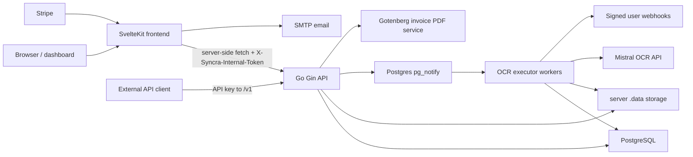
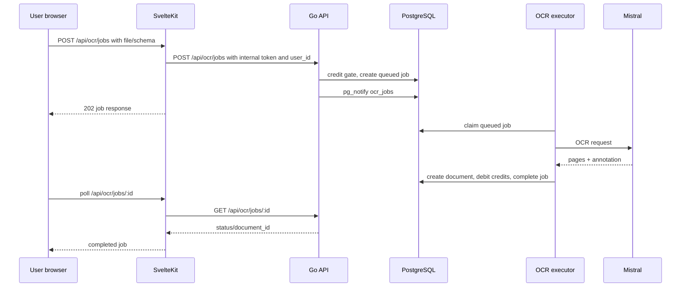

# Syncra

Syncra is a document OCR and structured extraction platform. It lets users upload PDFs and images, extract Markdown and JSON annotations through Mistral OCR, organize results by schema and collection, project completed documents into datasets, and integrate the same workflow through API keys and webhooks.

The repository contains three main areas:

- `server/` - Go API, PostgreSQL data model, Atlas migrations, OCR executor, billing, auth, webhooks, and Swagger generation.
- `frontend/` - SvelteKit application, protected dashboard, admin portal, SvelteKit API proxy layer, Stripe webhook handler, and UI components.
- `playground/` - Python experiments, sample files, schemas, notebooks, and webhook testing utilities.

## Product Scope

Syncra is built around these user-facing requirements:

- Authenticate users with email/password, email OTP verification, password reset, Google OAuth, GitHub OAuth, session management, account linking, account settings, and preferred language.
- Protect app pages behind authenticated sessions and protect admin pages behind `admin` role checks.
- Upload OCR inputs as PDFs, PNGs, or JPEGs, with configurable upload limits.
- Extract Markdown from documents and optionally produce structured JSON by supplying either a saved extraction schema or an inline JSON Schema.
- Process OCR jobs asynchronously so uploads return quickly and users can poll job status.
- Store completed documents with metadata, Markdown, annotation JSON, raw Mistral response JSON, page count, document hash, and optional schema link.
- Manage saved extraction schemas, including user-scoped schemas and admin-managed JSON recipe templates.
- Organize documents with collections. Collections can be associated with schemas, and completed documents are linked into matching collections automatically.
- Build datasets from schema fields. A dataset selects annotation JSON paths and can return rows or export CSV/XLSX.
- Expose developer integrations through API keys, a public OCR API, public balance lookup, and signed webhooks for job lifecycle events.
- Run a credit-based billing model: users receive configurable onboarding credits, buy credit top-ups through Stripe, and spend credits per successfully processed page.
- Provide billing profile, credit balance, credit usage history, orders, invoice PDF, and invoice email delivery workflows.
- Provide an admin portal for users, impersonation, credit adjustments, billing orders, invoices, and JSON recipe administration.
- Support English and Romanian UI localization through Paraglide/Inlang.

## Requirements

Functional requirements:

- Keep user-owned data isolated by authenticated owner id, API key owner id, or admin-only access.
- Return quickly from OCR uploads by queueing asynchronous jobs instead of blocking the request on provider OCR.
- Preserve full OCR provenance by storing raw provider responses alongside normalized Markdown and annotation JSON.
- Support structured extraction from both reusable saved schemas and one-off inline schemas.
- Prevent users from queueing more OCR pages than their available credit balance can cover.
- Debit credits only after OCR processing succeeds.
- Provide public API access without exposing internal user ids in public requests.
- Sign outbound webhooks so customer systems can verify event authenticity.
- Keep billing audit trails append-oriented through credit ledger entries and invoice/order records.
- Keep browser-visible code away from private service credentials, internal API tokens, Stripe secrets, and SMTP credentials.

Runtime and service requirements:

- PostgreSQL for all persistent application state and queue coordination.
- Mistral OCR API credentials for OCR processing.
- Writable local or mounted storage for OCR input files and invoice PDFs.
- A shared `SYNCRA_INTERNAL_API_TOKEN` configured identically in `server/.env` and `frontend/.env`.
- Strong `BETTER_AUTH_SECRET` and `APP_PRIVATE_KEY` values.
- Atlas CLI for applying or generating database migrations.
- Swagger CLI for regenerating `server/docs/swagger.json`.
- Node.js, pnpm, and the locked frontend dependency graph for the SvelteKit application.
- Stripe credentials and price ids for credit checkout flows.
- SMTP credentials for verification/password reset and invoice emails.
- Gotenberg URL for invoice PDF generation.
- Google/GitHub OAuth credentials if social auth should be enabled.

## Repository Layout

```text
.
├── server/
│   ├── cmd/api/              # API entrypoint
│   ├── cmd/syncra/           # CLI: api, migrate, dbseed, swagger
│   ├── internal/api/         # Gin handlers, routing, request/response contracts
│   ├── internal/app/         # Runtime wiring for API, database, OCR executor
│   ├── internal/auth/        # users, sessions, accounts, API keys, passwords/tokens
│   ├── internal/billing/     # credits, orders, invoices, pricing, ledger repository
│   ├── internal/config/      # environment configuration loading/validation
│   ├── internal/database/    # GORM connection and application model list
│   ├── internal/ocr/         # OCR models, Mistral processor, executor, datasets
│   ├── internal/webhooks/    # webhook configuration, encryption, HMAC delivery
│   ├── migrations/           # Atlas migrations
│   └── docs/swagger.json     # embedded Swagger document
├── frontend/
│   ├── src/hooks.server.ts   # auth/session loading, route guards, i18n, request logs
│   ├── src/routes/           # SvelteKit pages and BFF/API routes
│   ├── src/lib/server/       # server-only clients for Go API, Stripe, SMTP
│   ├── src/lib/client/       # browser/client helper APIs
│   ├── src/lib/components/   # app components and local UI primitives
│   ├── messages/             # source locale messages
│   └── project.inlang/       # Paraglide/Inlang config
├── playground/               # OCR experiments and local webhook tooling
├── docs/                     # implementation plans and design notes
└── graphify-out/             # generated codebase graph artifacts
```

## High-Level Architecture



The Go service is the system of record. It owns persistent state, OCR processing, billing state, public API auth, and internal API auth. The SvelteKit app owns the browser experience, route guards, localized rendering, server-side calls to the Go API, Stripe checkout/webhook integration, and SMTP email delivery.

The normal runtime starts one Go HTTP server and an in-process OCR executor. The HTTP handlers create queued OCR jobs and notify PostgreSQL. The executor listens for job notifications, also sweeps queued/stale work on an interval, claims jobs with row locks, runs OCR, stores results, debits credits, and emits webhooks.

## Server

### Stack

- Go module: `ai.ro/syncra`
- Go version in `go.mod`: `1.26.3`
- HTTP framework: Gin
- Database: PostgreSQL through GORM and pgx dependencies
- Schema management: Atlas migrations in `server/migrations`
- API docs: Swagger JSON embedded from `server/docs/swagger.json`
- OCR provider: Mistral OCR API
- PDF generation: Gotenberg for invoice PDFs
- Billing provider: Stripe, with webhook handling in the frontend

### Entrypoints

`server/cmd/api/main.go` loads environment config and starts the API directly.

`server/cmd/syncra/main.go` is the main operational CLI:

```sh
cd server
go run ./cmd/syncra api
go run ./cmd/syncra migrate
go run ./cmd/syncra dbseed --recipe_categories
go run ./cmd/syncra swagger
```

`syncra api --port PORT` overrides the configured API port while preserving the configured host.

### Configuration

Server configuration is loaded from environment variables, with `.env` support via `godotenv`. Start from `server/.env.example`.

Important server variables:

- `SERVER_HOST_PORT` - listen address, default `localhost:8080`
- `DEBUG` - switches Gin/logging behavior
- `DSN` - PostgreSQL DSN used by the application
- `ATLAS_DATABASE_URL` - target database URL for Atlas migration apply
- `ATLAS_DEV_DATABASE_URL` - scratch database URL for Atlas diff/lint workflows
- `SWAGGER_HOST`, `SWAGGER_SCHEMES` - emitted Swagger metadata
- `MISTRAL_API_KEY`, `MISTRAL_API_BASE_URL`, `MISTRAL_OCR_MODEL` - OCR provider configuration
- `MAX_UPLOAD_BYTES` - upload limit, default 20 MiB
- `STORAGE_DIR` - optional storage root. Defaults to `server/.data`
- `OCR_EXECUTOR_WORKERS`, `OCR_EXECUTOR_POLL_INTERVAL_SECONDS`, `OCR_EXECUTOR_QUEUE_BUFFER` - executor sizing
- `GOTENBERG_API_URL` - invoice PDF conversion endpoint
- `BETTER_AUTH_SECRET` - auth secret; validated for minimum strength
- `APP_PRIVATE_KEY` - private key for webhook secret encryption
- `AUTH_DELIVERY_TOKEN` - trusted token for server-side auth email delivery
- `SYNCRA_INTERNAL_API_TOKEN` - shared private token for SvelteKit-to-Go internal API calls
- `AUTH_SESSION_TTL_SECONDS`, `AUTH_VERIFICATION_TTL_SECONDS`, `AUTH_COOKIE_SECURE`
- `ONBOARDING_CREDITS` - signup credit grant, default `100`
- `GOOGLE_CLIENT_ID`, `GOOGLE_CLIENT_SECRET`
- `GITHUB_CLIENT_ID`, `GITHUB_CLIENT_SECRET`

Local development conventions require `DSN` and `ATLAS_DATABASE_URL` to target `syncra_dev`. PostgreSQL-backed tests use `DSN_DEV`.

### Server Modules

- `internal/app` wires config, logging, PostgreSQL, Mistral processor, webhook dispatcher, Gin router, HTTP server, and OCR executor lifecycle.
- `internal/api` owns Gin routes, request parsing, validation, auth/ownership checks, Swagger filtering, and JSON responses.
- `internal/ocr` owns extraction schemas, OCR jobs, OCR documents, collections, datasets, JSON recipes, the Mistral processor, durable file helpers, PostgreSQL notification, and executor logic.
- `internal/billing` owns billing profiles, credit purchase quotes, orders, invoices, credit buckets, append-only credit ledger entries, credit grants, debits, refunds, and adjustments.
- `internal/auth` owns user records, auth accounts, sessions, email verifications, password/token helpers, API key generation and hashing, roles, and admin impersonation records.
- `internal/webhooks` owns webhook records, encrypted webhook secrets, HMAC signing, event payloads, and delivery through a secure HTTP client.
- `internal/database` opens PostgreSQL and lists all GORM application models.
- `internal/dbmigrate` keeps legacy repair/data migration helpers. Normal schema evolution is handled by Atlas migration files.

### Data Model

The application model list includes:

- Auth: `user`, `account`, `session`, `verification`, `api_keys`, `admin_impersonation_events`
- OCR: `extraction_schemas`, `json_recipes`, `ocr_jobs`, `ocr_documents`
- Organization: `collections`, `collection_schemas`, `collection_documents`, `datasets`
- Billing: `billing_profiles`, `billing_invoice_counters`, `billing_invoices`, `billing_orders`, `credit_buckets`, `credit_ledger_entries`
- Integrations: `webhooks`

Important database constraints include user ownership foreign keys, OCR job status checks, cursor-friendly list indexes, a trigram index on OCR document filenames, unique API key hashes, unique signup bonus bucket per user, append-only credit ledger behavior, and invoice/order uniqueness.

### API Surface

The Go router separates internal and public APIs.

Internal `/api/...` routes are meant for trusted server-side callers and require `X-Syncra-Internal-Token`. Additional session/admin middleware is applied where appropriate.

Major internal groups:

- `/api/auth/...` - email auth, OAuth start/callback, sessions, accounts, user patching, API keys, webhook settings
- `/api/ocr/jobs` and `/api/ocr/jobs/:id` - asynchronous OCR jobs
- `/api/ocr/documents...` and `/api/ocr/document/:id` - document lists, detail, delete, rename, move, download
- `/api/ocr/schemas...` - extraction schema CRUD
- `/api/collection`, `/api/collections...` - collection CRUD
- `/api/datasets...` - dataset CRUD, rows, CSV/XLSX export
- `/api/billing...` - balance, profile, orders, invoices, PDF generation, credit usage history
- `/api/admin...` - admin users, impersonation, credit adjustments, billing orders/invoices, JSON recipes
- `/api/json-recipes` - list public recipes and deploy recipe schemas

Public `/v1/...` routes are for external clients and use API-key authentication from the `Authorization` header:

- `GET /v1/get-balance`
- `POST /v1/ocr/jobs`
- `GET /v1/ocr/jobs/:id`

Swagger is served in two filtered forms:

- `/swagger/doc.json` and `/swagger/` for internal API docs
- `/swagger-public/doc.json` and `/swagger-public/` for public API docs

### OCR Job Flow

1. A user uploads a PDF, PNG, or JPEG through the dashboard or public API.
2. The caller can provide no schema, a saved `schema_id`, or an inline JSON Schema. Public requests cannot submit a `user_id`; ownership is derived from the API key.
3. The server validates file type, filename length, upload size, schema shape, and schema ownership.
4. The server counts pages and computes a document hash from file bytes plus schema settings.
5. A per-user PostgreSQL advisory lock gates credit checks. Available credits are reduced by active queued/processing pages so users cannot over-queue work.
6. If available credits are insufficient, the API returns `402 Payment Required` with required and available credit counts.
7. The upload is written durably to `STORAGE_DIR/ocr-files` using a claim file, temp file, hard link, cleanup path, and directory syncs.
8. The API creates an `ocr_jobs` row with status `queued` and sends `pg_notify('ocr_jobs', job_id)`. Notification failure is tolerated because the sweeper recovers queued work.
9. Executor workers listen and sweep, claim queued jobs with `FOR UPDATE SKIP LOCKED`, set status to `processing`, and dispatch `job.started` webhooks.
10. The executor reads the stored file, resolves the saved or inline schema, calls Mistral `/v1/ocr`, joins page Markdown, parses document annotation JSON, and creates an `ocr_documents` row.
11. In the same completion transaction, the server links the document to matching schema collections, debits one credit per processed page, and marks the job `completed`.
12. If processing fails, the job is marked `failed` with a bounded error message. Lifecycle interrupts requeue the job.
13. Success/failure webhooks are dispatched asynchronously with signed payloads.

The older direct `POST /api/ocr` document endpoint still exists. It processes synchronously, supports a 24-hour hash cache, and stores an `ocr_documents` record directly.

### Billing and Credits

Credits are the unit of OCR consumption. A successful OCR job debits credits equal to the final page count.

Billing components:

- `CreditBucket` records granted or purchased credit inventory.
- `CreditLedgerEntry` records grants, purchases, debits, refunds, expiries, and adjustments. Ledger rows are append-only.
- `BillingOrder` tracks Stripe credit top-up orders.
- `BillingInvoice` and `BillingInvoiceLine` store invoice snapshots and line items.
- `BillingProfile` stores individual/company billing identity and address details.

Credit top-ups are quoted in 1,000-credit blocks with EUR pricing tiers:

- tier 1: below 5,000 credits at 1000 cents per block
- tier 2: 5,000+ credits at 950 cents per block
- tier 3: 10,000+ credits at 900 cents per block
- tier 4: 20,000+ credits at 850 cents per block

Stripe checkout is created by the SvelteKit frontend. Stripe webhooks are handled at `frontend/src/routes/api/billing/stripe/webhook/+server.ts`; after signature validation they mark Go billing orders paid/failed, trigger invoice email delivery, and acknowledge Stripe.

### Webhooks

Users can configure webhooks for:

- `job.started`
- `job.failed`
- `job.succeeded`

Webhook secrets are encrypted with `APP_PRIVATE_KEY`. Deliveries include:

- `X-Syncra-Timestamp`
- `X-Syncra-Signature`

The signature contract is HMAC-SHA256 over `timestamp + "." + rawBody`, emitted as `v1=<hex>`. The default dispatcher disables redirects and validates the resolved address before dialing.

## Frontend

### Stack

- SvelteKit with Svelte 5 runes mode
- TypeScript
- Vite
- SvelteKit adapter-node
- Tailwind CSS v4
- shadcn-svelte-style local components and Bits UI primitives
- TanStack Svelte Query
- Paraglide/Inlang localization
- Stripe SDK for checkout and webhook verification
- Nodemailer for auth and invoice email delivery
- Scalar API reference for `/apidoc`

### Configuration

Start from `frontend/.env.example`.

Important frontend variables:

- `SYNCRA_API_BASE_URL` - private Go API base URL, default `http://localhost:8080`
- `SYNCRA_APP_ORIGIN` - public app origin used for links and Stripe return URLs
- `SYNCRA_INTERNAL_API_TOKEN` - shared token sent only from SvelteKit server routes to Go
- `AUTH_DELIVERY_TOKEN` - trusted auth email delivery token; should match the server value when enabled
- `AUTH_COOKIE_SECURE` - optional auth cookie secure override
- `STRIPE_SECRET_KEY`, `STRIPE_WEBHOOK_SECRET`
- `STRIPE_PRICE_ID_TIER_1` through `STRIPE_PRICE_ID_TIER_4`
- `MAIL_SMTP_HOST`, `MAIL_SMTP_PORT`, `MAIL_SMTP_USER`, `MAIL_SMTP_PASSWORD`, `MAIL_SMTP_FROM`, `MAIL_SMTP_TLS`

### Frontend Runtime Shape

`src/hooks.server.ts` is the central server hook. It:

- creates and propagates a request id
- loads session/user/impersonation/admin context from the Go auth API
- clears stale session cookies when the backend no longer recognizes them
- guards `/app` and `/admin-portal` routes
- redirects authenticated users away from guest-only auth pages
- applies Paraglide middleware and localized `<html lang>` / direction attributes
- logs request metadata and response status

Browser code generally talks to SvelteKit `/api/...` routes. Those routes call `$lib/server/*` helpers, which call the Go API with `SYNCRA_API_BASE_URL` and `X-Syncra-Internal-Token`. This keeps Go credentials, Stripe secrets, SMTP settings, and internal API tokens out of browser bundles.

### Frontend Routes

Public and marketing routes:

- `/` - landing page
- `/pricing` - pricing page
- `/ocr-recipes` - public recipe listing
- `/apidoc` - Scalar API reference backed by `/api/swagger/doc.json`

Auth routes:

- `/login`
- `/signup`
- `/signup-confirmation`
- `/recover-password`
- `/logout`
- OAuth callback/link routes under `/api/auth/...`

User app routes:

- `/app` - dashboard shell
- `/app/new-job` - upload OCR jobs and poll progress
- `/app/jobs` - job list and status management
- `/app/documents` - completed document library, preview, rename, collection moves, download
- `/app/schemas`, `/app/schemas/new`, `/app/schemas/edit/[id]` - schema management and JSON schema builder
- `/app/datasets`, `/app/datasets/[id]` - dataset definitions, rows, and export workflows
- `/app/billing`, `/app/billing/orders`, `/app/billing/credit-usage-history` - credit and billing workflows
- `/app/developer-settings` - API keys and webhook configuration

Admin routes:

- `/admin-portal`
- `/admin-portal/users` and `/admin-portal/users/[id]`
- `/admin-portal/invoices`
- `/admin-portal/orders`
- `/admin-portal/json-recipes`, `/new`, and `/[id]`

SvelteKit API/BFF route groups:

- `/api/auth/...`
- `/api/ocr/...`
- `/api/schemas...`
- `/api/collections...`
- `/api/datasets...`
- `/api/billing...`
- `/api/admin...`
- `/api/json-recipes...`
- `/api/swagger/doc.json`

### UI Architecture

The app shell uses `AppSidebar`, `SiteHeader`, credit balance loading, collection and dataset navigation, account controls, impersonation banner, shared toasts, and confirmation dialogs. The admin shell uses `AdminSidebar` with users, invoices, JSON recipes, and orders.

Route-specific API clients and state utilities live next to their routes when they are only used there. Reusable API clients live under `src/lib/client`, and server-only Go API clients live under `src/lib/server`.

The local UI component library lives under `src/lib/components/ui`; app-specific components live under `src/lib/components`.

## Key End-to-End Flows

### Dashboard OCR



### Public API OCR

External clients use the public `/v1` API with an API key. The Go server derives ownership from the API key, rejects user-supplied `user_id`, checks credits, queues the job, and lets clients poll `GET /v1/ocr/jobs/:id` until the job is terminal.

### Dataset Projection

Users create a dataset from one saved schema and a list of selected JSON pointer fields. Dataset rows are generated by finding matching documents for the user/schema and projecting each document's `annotation_json` into selected columns. Exports are available as CSV or XLSX.

### Billing Top-Up

The frontend creates a billing order through the Go API, creates a Stripe checkout session server-side, and sends the browser to Stripe. Stripe calls the SvelteKit webhook route. The webhook verifies Stripe's signature, marks the Go order paid or failed, grants purchased credits, and attempts invoice email delivery with a generated PDF attachment.

### Admin Impersonation

Admins can start an impersonation session from the admin portal. The session stores the impersonated user id and audit metadata. The frontend exposes the target user context while preserving the admin identity for authorization and audit trails.

## Local Development

### Server

```sh
cd server
cp .env.example .env
# Edit .env so DSN and ATLAS_DATABASE_URL target syncra_dev.
go test ./...
go run ./cmd/syncra migrate
go run ./cmd/syncra api
```

Use the unified CLI for operational tasks:

```sh
cd server
go run ./cmd/syncra api --port 8080
go run ./cmd/syncra migrate
go run ./cmd/syncra swagger
```

Atlas and Swagger commands require their respective CLIs on `PATH`.

### Frontend

```sh
cd frontend
cp .env.example .env
pnpm install
pnpm dev
```

Common checks:

```sh
cd frontend
pnpm check
pnpm test
pnpm build
```

The SvelteKit development server defaults to Vite's local port, and `SYNCRA_API_BASE_URL` defaults to `http://localhost:8080`.

### Playground

The playground is Python-based and uses root `pyproject.toml` / `uv.lock`.

```sh
uv sync
```

Use `playground/` for OCR experiments, sample schemas, local webhook testing, and notebooks. Avoid pointing experiments at shared or production resources.

## API Documentation

The Go server serves embedded Swagger JSON. The frontend exposes a Scalar UI at `/apidoc` that reads `/api/swagger/doc.json`, which proxies the Go Swagger document.

Regenerate Swagger after changing API routes or request/response contracts:

```sh
cd server
go run ./cmd/syncra swagger
```

The command runs `swagger generate spec --work-dir cmd/syncra --scan-models -o docs/swagger.json` and then validates `docs/swagger.json`.

## Testing

Server:

```sh
cd server
go test ./...
```

Useful focused server checks:

```sh
cd server
go test ./internal/api
go test ./internal/ocr
go test ./internal/billing
go test ./internal/database ./internal/dbmigrate
```

Frontend:

```sh
cd frontend
pnpm check
pnpm test
pnpm build
```

PostgreSQL-backed server tests rely on `server/.env` and `DSN_DEV`. Keep `DSN_DEV` pointed at `syncra_dev` for local/agent work.

## Operational Notes

- `STORAGE_DIR` defaults to `server/.data`; OCR job files go under `ocr-files`, and invoice PDFs go under `invoices`.
- OCR job notifications are an acceleration path. The executor sweeper still finds queued jobs if `pg_notify` is missed.
- Credit debits happen on successful OCR completion, but queue admission reserves capacity by subtracting queued/processing pages from available credits.
- Webhook delivery failures are logged and do not roll back completed OCR jobs.
- Stripe invoice email delivery failures are logged and do not fail the Stripe webhook acknowledgement.
- API keys are stored hashed; only the one-time raw key is returned on creation.
- The public API accepts either raw API key authorization or `Bearer <api_key>`.
- Generated/local state, `.env` files, and secrets should not be committed.
